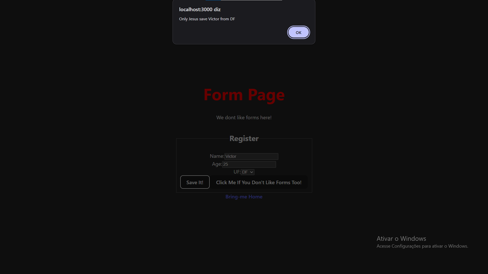

# React Intro

An educational project to learn the fundamentals of **React** with **TypeScript** and **Vite**.

## 🎯 Features

- **Home Page**: An interactive counter that increments with each click
- **Form Page**: A form with:
  - Input fields (name, age)
  - Brazilian states dropdown (integrated with IBGE API)
  - State management and validation using React Hooks
- **Routing**: Page navigation using React Router

### Screenshots

**Home Page:**


**Form Page:**


## 🛠 Tech Stack

- **React 19** - UI Library
- **TypeScript** - Static typing
- **Vite** - Ultra-fast build tool and dev server
- **React Router v7** - Page routing
- **Axios** - HTTP client for API calls
- **ESLint** - Code linting

## 📦 Installation

```bash
# Clone the repository
git clone https://github.com/Ritcov/react-intro.git
cd react-intro

# Install dependencies
npm install
```

## 🚀 Getting Started

```bash
# Development mode
npm run dev

# Build for production
npm run build

# Preview the production build
npm run preview

# Run linter
npm run lint
```

The app will be available at `http://localhost:5173` (or another port indicated by Vite).

## 📝 Project Structure

```
src/
├── components/
│   └── Header.tsx       # Reusable header component
├── pages/
│   ├── Home.tsx         # Home page with counter
│   ├── Home.css         # Home styles
│   └── Form.tsx         # Form page
├── assets/              # Images and assets
├── main.tsx             # Entry point
├── router.tsx           # Route configuration
└── index.css            # Global styles
```

## 🎓 Learning Concepts

- ✅ Functional components
- ✅ Hooks: `useState`, `useEffect`
- ✅ Props and TypeScript typing
- ✅ State management
- ✅ Controlled form inputs
- ✅ HTTP requests (Axios)
- ✅ SPA routing with React Router

## 🎓 Course

This project is based on the React intro course taught by **Prof. LuizTools**:
- 📺 [Full course video on YouTube](https://www.youtube.com/watch?v=oqXNj8umBXI)

## 📚 References

- [React Docs](https://react.dev)
- [Vite Docs](https://vitejs.dev)
- [React Router Docs](https://reactrouter.com)
- [IBGE API](https://servicodados.ibge.gov.br)

## 📄 License

MIT
